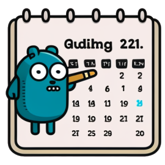

# Go Sync Cal




A GoLang project that allows you to synchronize two Google Calendars


## Introduction

This is a GoLang project that allows you to synchronize two Google Calendars. 
It can be useful for individuals or organizations who want to keep their schedules in sync across multiple email accounts.

## Prerequisites
- GoLang installed on your system
- Google Calendar API enabled on your Google Cloud Console. [How To](https://developers.google.com/calendar/api/quickstart/go#enable_the_api)
- Google Calendar OAuth 2.0 credentials. [How To](https://developers.google.com/calendar/api/quickstart/go#authorize_credentials_for_a_desktop_application)

## Setting up the project

- Clone the repository to your local machine:

```bash
$ git clone https://github.com/marianozunino/go-sync-cal.git
```

- Go to the project directory:

```bash
$ cd go-sync-cal
```

- Install required packages:

```bash
$ go install
```

- Copy the contents of `config.json.example` into `config.json`:

```bash
$ cp config.json.example config.json
$ cat config.json
{
  "source":"Source",
  "sourceCredentialsFile":"source-credentials.json",
  "destination":"Destination",
  "destinationCredentialsFile":"destination-credentials.json",
  "syncOptions": {
    "twoWaySync": false,
    "redactedSummary": false,
    "redactedDescription": true,
    "redactedLocation": true,
    "redactedAttendees": true,
    "redactedAtatchments": true,
    "disableReminders": true,
    "redactedOrganizer": true,
    "eventColor":"11"
  }
}
```

## Configuring the project

```json
{
  "source":"Source",
  "sourceCredentialsFile":"source-credentials.json",
  "destination":"Destination",
  "destinationCredentialsFile":"destination-credentials.json",
  "syncOptions": {
    "twoWaySync": false,
    "redactedSummary": false,
    "redactedDescription": true,
    "redactedLocation": true,
    "redactedAttendees": true,
    "redactedAtatchments": true,
    "disableReminders": true,
    "redactedOrganizer": true,
    "eventColor":"11"
  }
}
```

- `source`: The name of the source calendar. It can be anything you want. For example, the company name.
- `sourceCredentialsFile`: The name of the file that contains the credentials for the source calendar. This file is generated by GCloud when you create the OAuth 2.0 credentials for the source calendar.
- `destination`: Read the description for `source`.
- `destinationCredentialsFile`: Read the description for `sourceCredentialsFile`.

### Sync Options

- `twoWaySync`: If set to `true`, the program will synchronize events from both calendars. If set to `false`, the program will only synchronize events from the source calendar to the destination calendar.
- `redactedSummary`: If set to `true`, the program will remove the summary of the event and replace it with the text `Redacted`.
- `redactedDescription`: If set to `true`, the program will remove the description of the event and replace it with the text `Redacted`.
- `redactedLocation`: If set to `true`, the program will remove the location of the event and replace it with the text `Redacted`.
- `redactedAttendees`: If set to `true`, the program will remove the attendees of the event.
- `redactedAtatchments`: If set to `true`, the program will remove the attachments of the event.
- `disableReminders`: If set to `true`, the program will remove the reminders of the event.
- `redactedOrganizer`: If set to `true`, the program will remove the organizer of the event.
- `eventColor`: The color of the event. The color is represented by a number between 1 and 11.

    [Here's](./assets/colors-chart.jpg) a chart that shows the color of each number.

## Running the project

- Build the project:

```bash
$ go build ./cmd/app
```

- Run the executable file:

```bash
$ ./app
```

If it's the first time that you ran the program, a browser window will open for each calendar so you can authorize the program to access your Google Calendars.
If the browser window doesn't open, you can copy the URL from the terminal and paste it in your browser.

Also a local http server will be started on port 5000 in order to receive the authorization code from Google. Once you authorize the program, the server will pick up the code and stop listening for requests.

With the authorization code, the program will complete the OAuth 2.0 flow and get an access token which will be stored in a file called `<soruce/destination>-token.json` in the same directory as the executable file.

From now on, the program will use the access token to access your calendars (so it may be safe to delete the credentials file).

